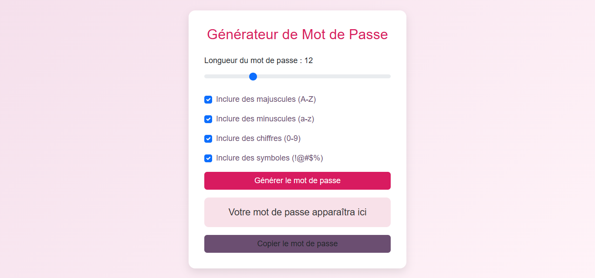

# 🔐 Générateur de Mot de Passe

Un générateur de mots de passe sécurisés et personnalisables.

## 📸 Aperçu

## ✨ Fonctionnalités

- Longueur ajustable (6-30 caractères)
- Types de caractères configurables
- Copie automatique dans le presse-papiers

## 🚀 Installation

1. Clonez le repository
2. Ouvrez `index.html` dans votre navigateur

## 📖 Utilisation

1. Ajustez la longueur souhaitée
2. Sélectionnez les types de caractères
3. Cliquez sur "Générer le mot de passe"
4. Copiez le résultat